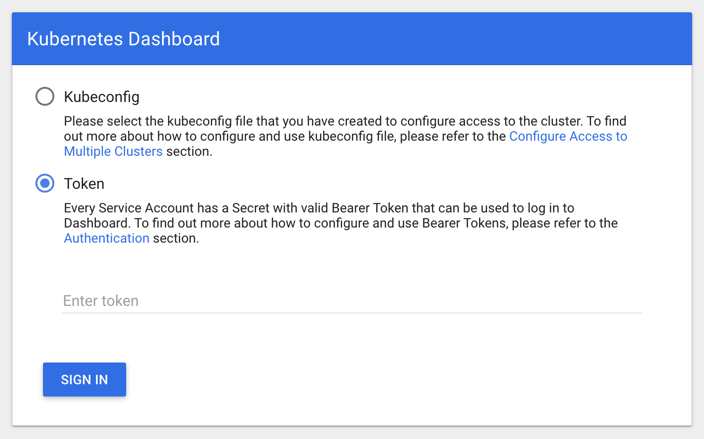
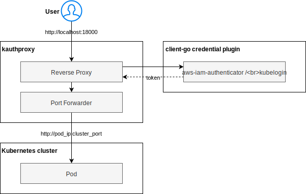

# kauthproxy [](https://circleci.com/gh/int128/kauthproxy)

This is a kubectl plugin to access the [Kubernetes Dashboard](https://github.com/kubernetes/dashboard) via the authentication proxy.


## Purpose

Kubernetes Dashboard is a cool web UI for Kubernetes clusters.
It supports the token authentication and you can enter a token on the startup screen.



It is best practice to use your own token for security.
For example,

1. Audit logging.
1. Access control per user.

Do not share a token of a service account because it may break security principle.
You can use OpenID Connect authentication (e.g. [kubelogin](https://github.com/int128/kubelogin)) or cloud provider based authentication (e.g. [aws-iam-authenticator](https://github.com/kubernetes-sigs/aws-iam-authenticator) or Azure AD).


## Getting Started

### Set up

Install the latest release from [Homebrew](https://brew.sh/), [Krew](https://github.com/kubernetes-sigs/krew) or [GitHub Releases](https://github.com/int128/kauthproxy/releases).

```sh
# Homebrew
brew install int128/kauthproxy/kauthproxy

# Krew
kubectl krew install auth-proxy

# GitHub Releases
curl -LO https://github.com/int128/kauthproxy/releases/download/v0.7.0/kauthproxy_linux_amd64.zip
unzip kauthproxy_linux_amd64.zip
ln -s kauthproxy kubectl-auth_proxy
```

Make sure authentication of your cluster is configured.
See also the articles:

- For Amazon EKS, set up the kubeconfig to [use the aws-iam-authenticator or `aws eks get-token`](https://docs.aws.amazon.com/eks/latest/userguide/create-kubeconfig.html).
- For OpenID Connect, set up the kubeconfig to use [kubelogin](https://github.com/int128/kubelogin).

You can deploy the Kubernetes Dashboard to the cluster from [the chart](https://github.com/kubernetes/charts/tree/master/stable/kubernetes-dashboard).

```sh
helm install stable/kubernetes-dashboard --namespace kube-system --name kubernetes-dashboard
```

### Run

To access the Kubernetes Dashboard:

```
% kubectl auth-proxy -n kube-system https://kubernetes-dashboard.svc
Starting an authentication proxy for pod/kubernetes-dashboard-57fc4fcb74-jjg77:8443
Open http://127.0.0.1:18000
Forwarding from 127.0.0.1:57866 -> 8443
Forwarding from [::1]:57866 -> 8443
```

It will automatically open the browser and show the Kubernetes Dashboard logged in as you.
You do not need to enter your token.


## How it works?

kauthproxy is a kubectl plugin which provides the reverse proxy and port forwarder.
Take a look at the diagram:



When you access the Kubernetes Dashboard, the kauthproxy forwards HTTP requests by the following process:

1. Acquire your token from the credential plugin or authentication provider.
   The token is cached and will be refreshed on expiration.
1. Set `authorization: bearer TOKEN` header to a request and forward the request to the pod of Kubernetes Dashboard.


## Usage

```
Forward a local port to a pod or service via the authentication proxy.
It gets a token from the current credential plugin (e.g. EKS, OpenID Connect).
Then it appends the authorization header to HTTP requests, like "authorization: Bearer token".
All traffic is routed by the authentication proxy and port forwarder as follows:
  [browser] -> [authentication proxy] -> [port forwarder] -> [pod]

Usage:
  kubectl auth-proxy POD_OR_SERVICE_URL [flags]

Examples:
  # To access a service:
  kubectl auth-proxy https://kubernetes-dashboard.svc

  # To access a pod:
  kubectl auth-proxy https://kubernetes-dashboard-57fc4fcb74-jjg77

Flags:
      --add_dir_header                   If true, adds the file directory to the header
      --address stringArray              The address on which to run the proxy. If set multiple times, it will try binding the address in order (default [127.0.0.1:18000,127.0.0.1:28000])
      --alsologtostderr                  log to standard error as well as files
      --as string                        Username to impersonate for the operation
      --as-group stringArray             Group to impersonate for the operation, this flag can be repeated to specify multiple groups.
      --cache-dir string                 Default HTTP cache directory (default "~/.kube/http-cache")
      --certificate-authority string     Path to a cert file for the certificate authority
      --client-certificate string        Path to a client certificate file for TLS
      --client-key string                Path to a client key file for TLS
      --cluster string                   The name of the kubeconfig cluster to use
      --context string                   The name of the kubeconfig context to use
  -h, --help                             help for kubectl
      --insecure-skip-tls-verify         If true, the server's certificate will not be checked for validity. This will make your HTTPS connections insecure
      --kubeconfig string                Path to the kubeconfig file to use for CLI requests.
      --log_backtrace_at traceLocation   when logging hits line file:N, emit a stack trace (default :0)
      --log_dir string                   If non-empty, write log files in this directory
      --log_file string                  If non-empty, use this log file
      --log_file_max_size uint           Defines the maximum size a log file can grow to. Unit is megabytes. If the value is 0, the maximum file size is unlimited. (default 1800)
      --logtostderr                      log to standard error instead of files (default true)
  -n, --namespace string                 If present, the namespace scope for this CLI request
      --request-timeout string           The length of time to wait before giving up on a single server request. Non-zero values should contain a corresponding time unit (e.g. 1s, 2m, 3h). A value of zero means don't timeout requests. (default "0")
  -s, --server string                    The address and port of the Kubernetes API server
      --skip_headers                     If true, avoid header prefixes in the log messages
      --skip_log_headers                 If true, avoid headers when opening log files
      --stderrthreshold severity         logs at or above this threshold go to stderr (default 2)
      --token string                     Bearer token for authentication to the API server
      --user string                      The name of the kubeconfig user to use
  -v, --v Level                          number for the log level verbosity
      --version                          version for kubectl
      --vmodule moduleSpec               comma-separated list of pattern=N settings for file-filtered logging
```


## Contributions

This is an open source software.
Feel free to open issues and pull requests.
